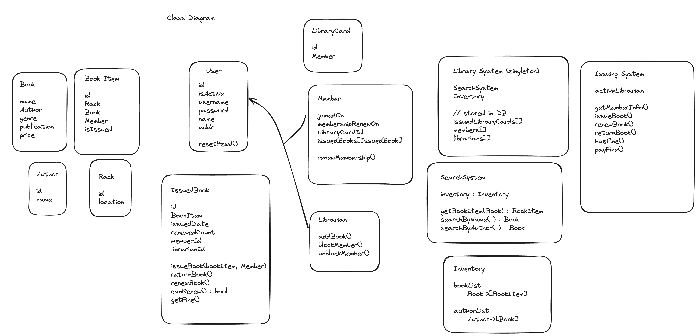

**Requirements** ( Library Management System )
* Store Books available, enable searching and catagorizing
    * One book can have multilpe coppies
    * Add and remove books
* Create users Members and Librarian accounts
* Issue books and track them
    * User get's the book for 15 days at max, and this can be renewed once (ie making max possible 30 days)
    * Pricing, subscription and fine managemnt

**Entities**
* Book
* Book Item 
* User 
* Member 
* Librarian

Class Diagram ( Rough )

