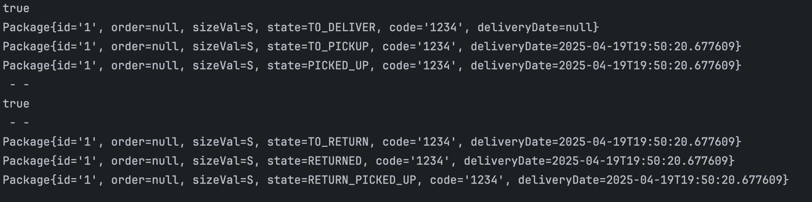

 Requirements :

 BASE STRUCTURE
* Customer can select the nearest pickup locker location when placing the order
* One order may contain more than one items, and one erder will be packaged before delivering the order
* There are multiple locker sizes - xs, s, m, l, xl, xxl
* There can be multiple lockers in all locations

 ORDER FEATURE
* Locker is assigned to customer based on size of order package ( ie, locker shoyld be bigger than package )
* When order is delivered to locker location, a 6 digit code sent to customer
* Package is kept for 3 days, post that, refund is initiated, and customer should not be able to open locker.
* If customer picks up order, the state is changed to close, and should not open with code then.

 TIME FUNCTIONALITY
* Amazon lockers are accessible in a specific time [ ie. opening closing time ]

 RETURN FEATURE
* User can return an order,
* choose nearby locker, and will be assigned the locker accordingly

 CORE ENTITIES
* Customer ->  id, order[]
* Order -> id, item[], deliveryLocation
* Item -> id, productCode
* Package -> Order, packageId, PackageSize, code
* Locker Hub -> locationId, locker[], interactiveScreen, openTime, closeTime
* Interactive Screen -> buttons, screen
* Locker -> Booking State, Door State, openLocker, closeLocker, Package

* Locker Booking State -> Available, Booked
* Locker Door State -> Open, Close
* Package State -> ToDeliver, ToPickUp, PickedUp, Returned
* Size -> xs, s, m, l, xl, xxl

* Locker System -> Locker Hub[] ,
 
  *Methods :*

  *General*
  * addLockerHub(location, hub)
  
  *Order Feature*
  * assignLocker(location, Package)
  * completeDelivery(location, Package, code)
  * pickupOrder(location, Package, code)

  *Return Feature*
  * assignLocker (Same as above)
  * completeReturn(location, Package, code)
  * pickupReturn(location, Package, code)

  *Time Functionality*
  * isHubOpen(hub)

* Notification Service
* Deliver Order
* PackageOverdueHandler

Assumptions:

* Package creation is managed by some other service
* There is a service which is responsible for notifications

Main Class Code in Action:
